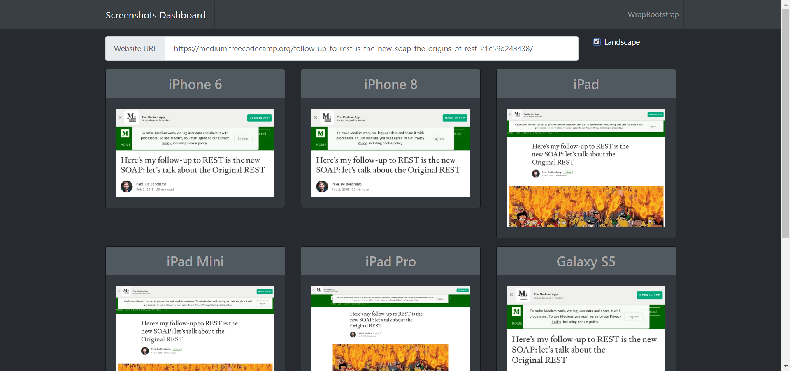

# Website Preview Dashboard

This project will easily display how your website is seen on different devices. Either in portrait or landscape mode. Click an image to see it in full a modal.

The project has a backend API to serve website screenshots and a UI dashboard to select the URL you want to show. For details on each sub-project review included readme.md files.

## API

Node express project that uses Puppeteer to expose an API to get images from an URL with a given device emulation.

## Dashboard

Vue.js Bootstrap 4 dashboard that creates a grid of devices that will show a how the same website can be rendered on different devices at a glance.

## TODO

- Add parameter to docker args to use sandbox mode only in containers
- Return browser sides and include the ability to scroll pages.

## Dockerfile

To make things even easier it can be run in a Docker container. The dockerfile builds the website application and bundles it with the main server that handles the API.

`docker build -t guillemsola/website-renderer .`

## Technology Stack

